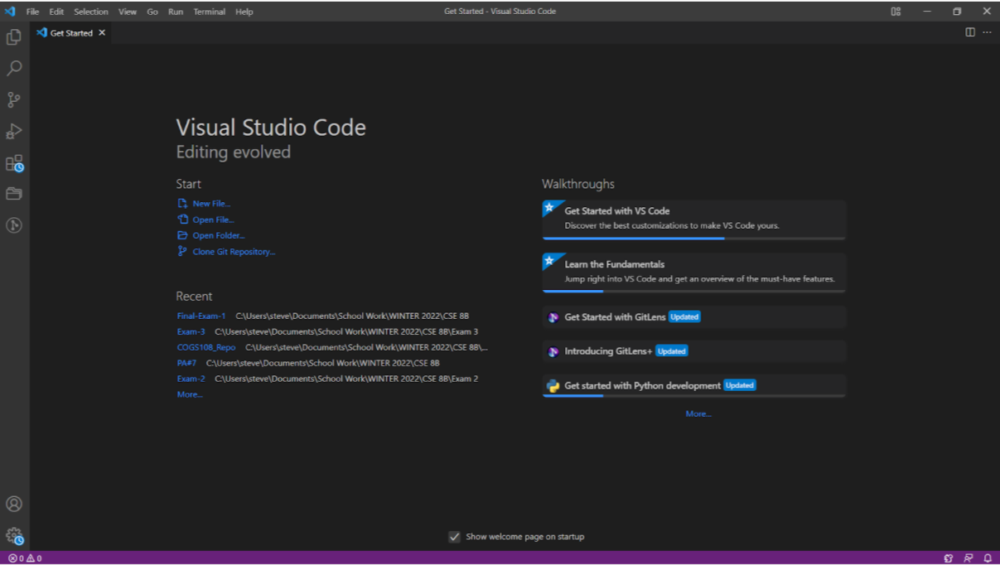

# Welcome incoming students of CSE 15L and future-self!

## What is this page for?
This page is teaching you and reminding me how to use log into ieng account. That is just a server where you can store files in.

## Lets get started!

**Step one**: If you have not done this before you would want to download your choice of a code editor, this course uses VSCode so you will want to go to this website [VSCode](https://code.visualstudio.com/download) and press the button that corresponds with your computer's OS.
When you open up VSCode it should look something like this:

**Step two**: 
