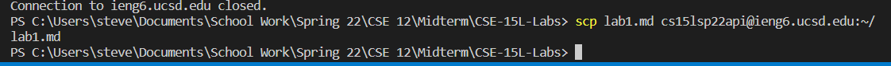
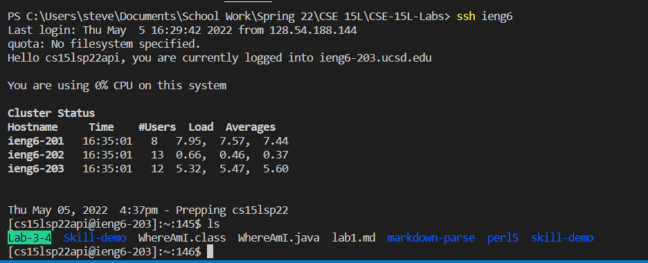
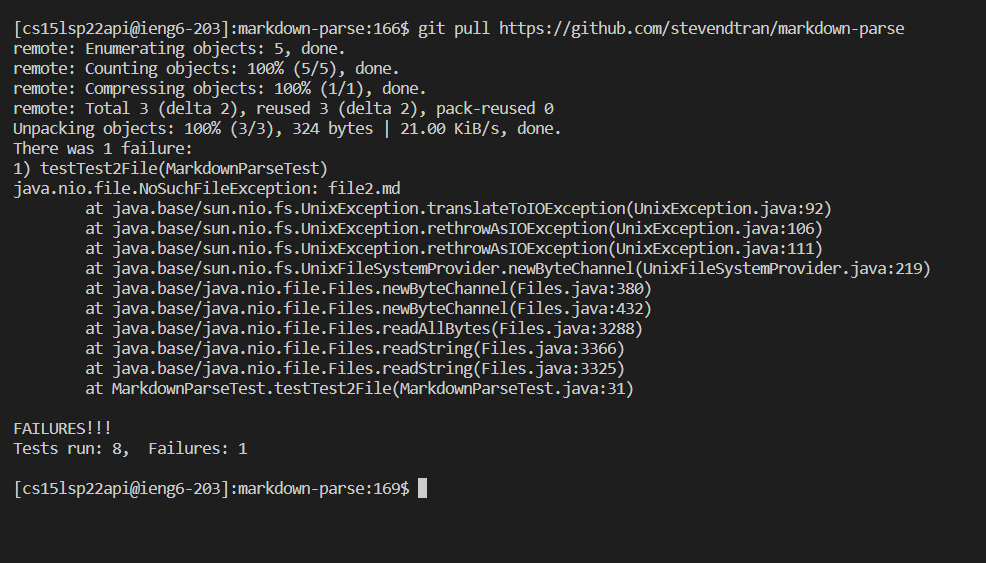
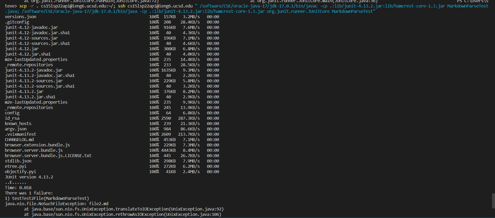
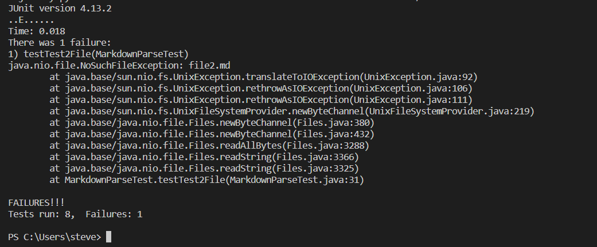

# Lab Report 3

## Streamlining ssh Configuration
1. I was using a windows machine so I manually went into the .ssh file in the user to make the config file. Then I copied and pasted the user and hostname into the config file.  

2. With that I no longer had to type in the hostname and username instead I used the alias ieng6.  

3. I used the `scp` command to copy a file from my local desktop to the ieng6 server.  
  

## Setup Github Access from ieng6
1. The public is stored in Github in the settings.  

2. The private is store in `~/.ssh`.  

3. Now you can run: `git add .`, `git commit -m ""`, and `git push` in the ieng6 terminal.  

4. Here is the [link](https://github.com/stevendtran/markdown-parse/commit/e5a0f9e5aace39f345da0c18df4d1eac1663aed7) to that commit.  

## Copy whole directories with scp -r
1. Copying over the whole markdown-parse directory into ieng6 account.

2. Here I will be running the tester in markdown-parse using `javac -cp .:lib/junit-4.13.2.jar:lib/hamcrest-core-1.3.jar MarkdownParseTest.java` and `java -cp .:lib/junit-4.13.2.jar:lib/hamcrest-core-1.3.jar org.junit.runner.JUnitCore MarkdownParseTest`.  
  
3. Combining `scp` and `ssh` using `;` to copy the whole directory and run all the test in one line.  
  
  

P.S. My lab group an I were unable to solve one of the testers, so in the pictures only 8/9 of the test pass.
