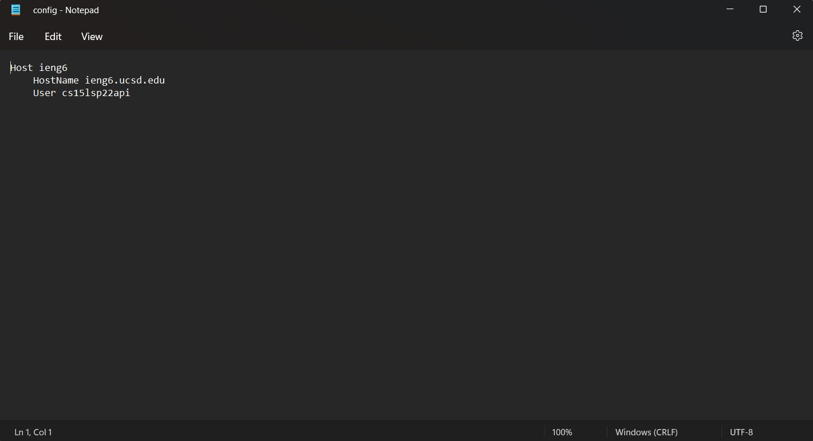
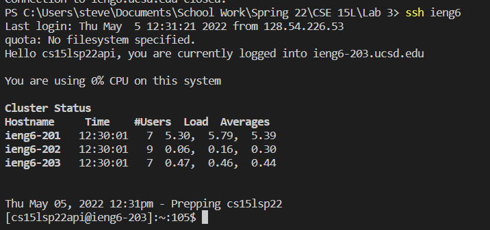
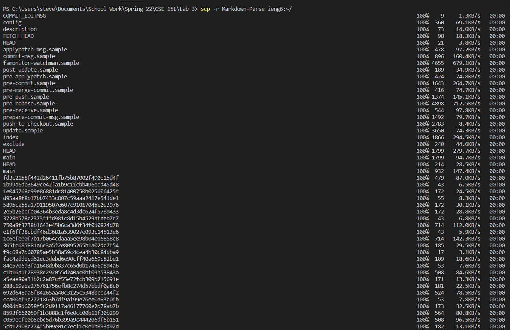
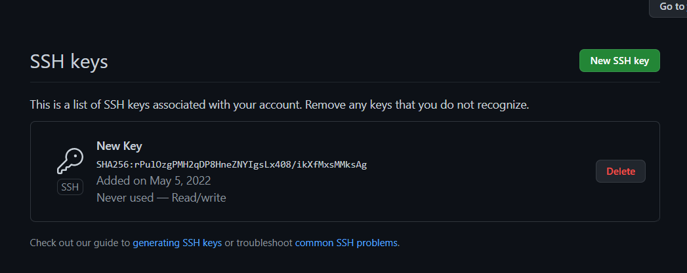
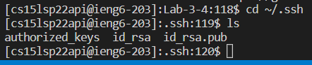
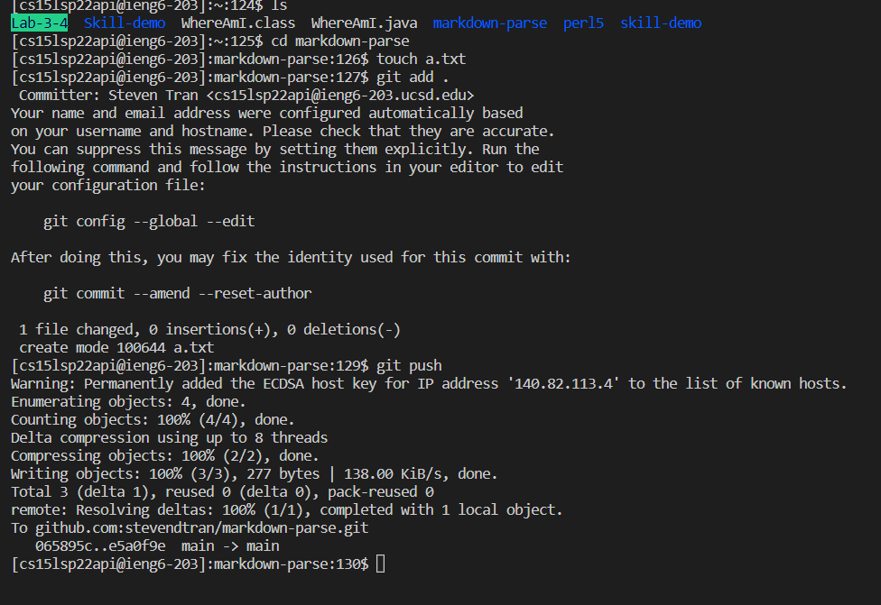

# Lab Report 3

## Streamlining ssh Configuration
1. I was using a windows machine so I manually went into the .ssh file in the user to make the config file. Then I copied and pasted the user and hostname into the config file.  

2. With that I no longer had to type in the hostname and username instead I used the alias ieng6.  

3. I used the `cp` command to copy a file from my local desktop to the ieng6 server.  

## Setup Github Access from ieng6
1. The public is stored in Github in the settings.  

2. The private is store in `~/.ssh`.

3. Now you can run: `git add .`, `git commit -m ""`, and `git push` in the ieng6 terminal.

4. Here is the [link](https://github.com/stevendtran/markdown-parse/commit/e5a0f9e5aace39f345da0c18df4d1eac1663aed7) to that commit.

