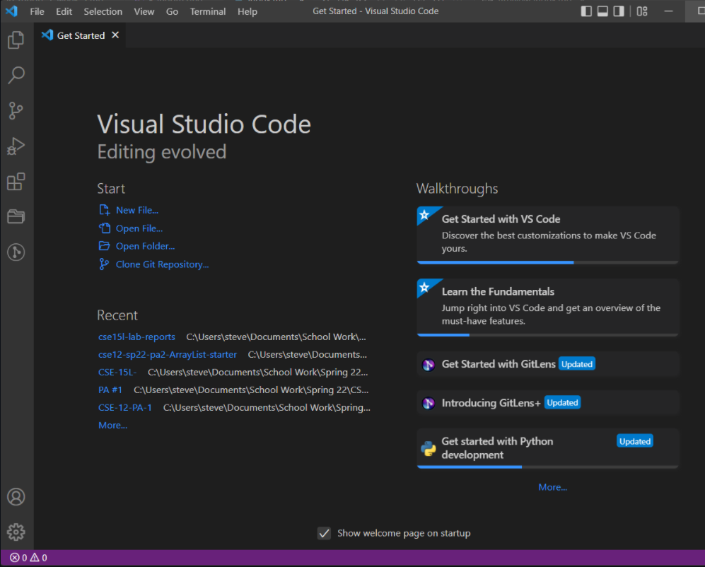
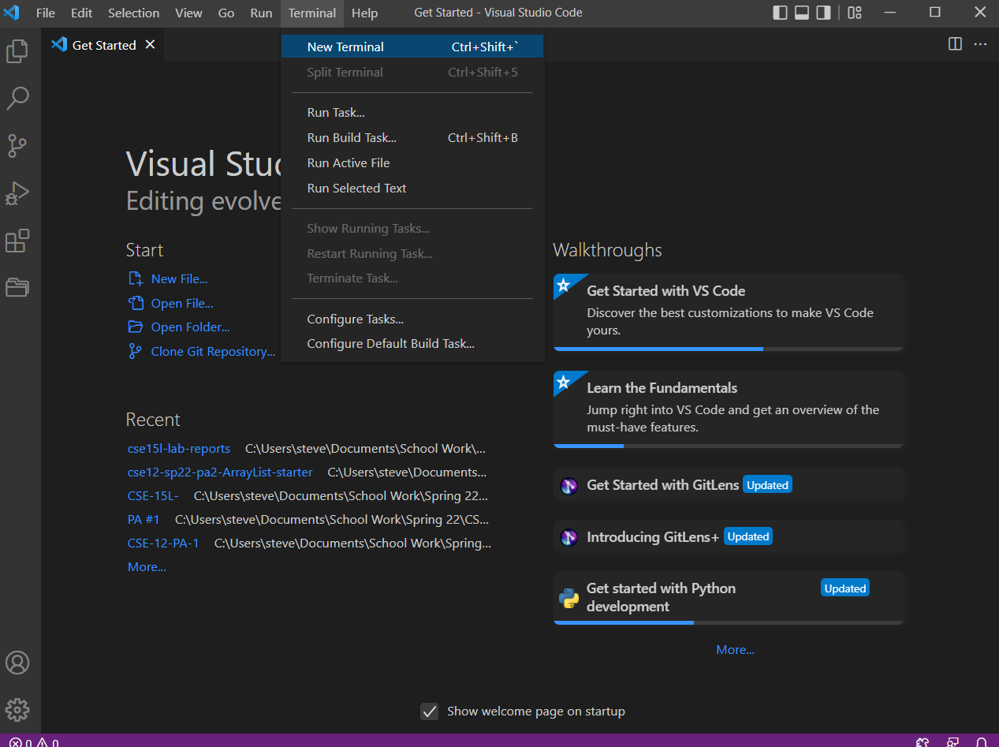
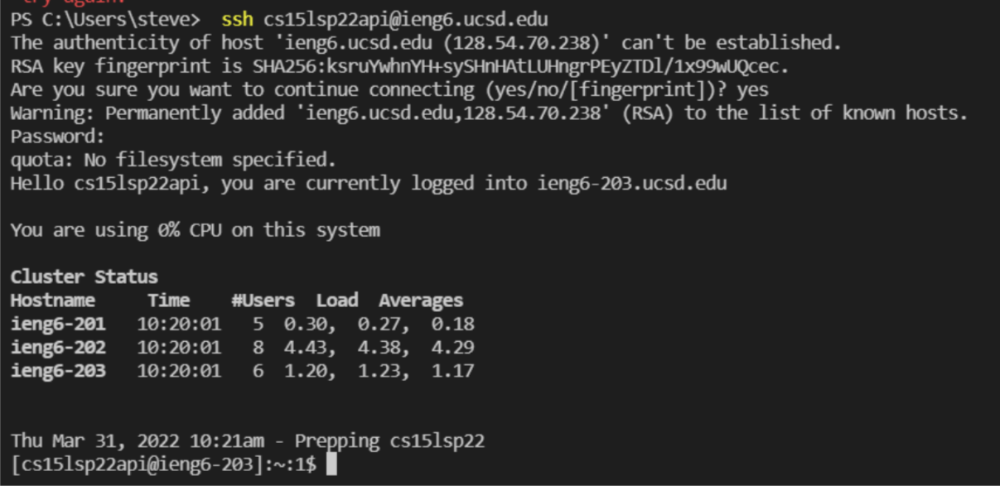
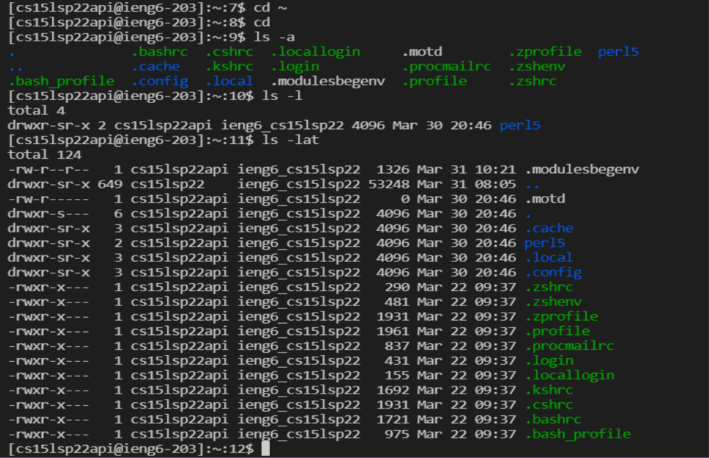
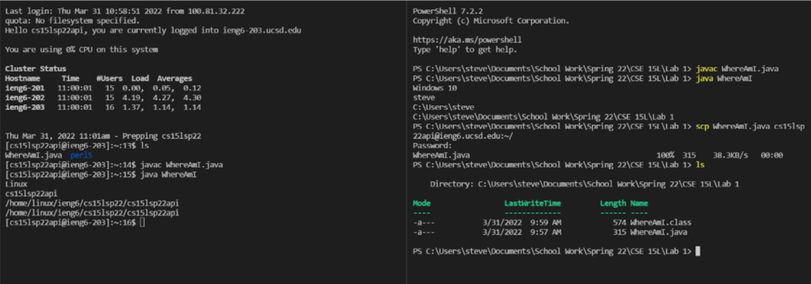
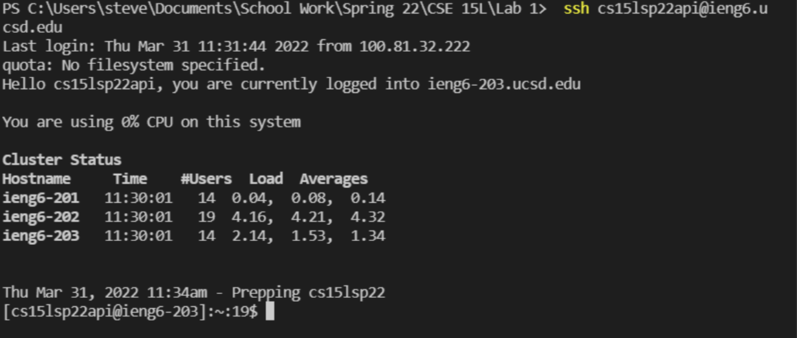
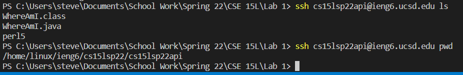

# Welcome incoming students of CSE 15L and future-self!

## What is this page for?
This page is teaching you and reminding me how to use log into ieng account. That is just a server where you can store files in.

## Lets get started!

**Step one**: If you have not done this before you would want to download your choice of a code editor, this course uses VSCode so you will want to go to this website [VSCode](https://code.visualstudio.com/download) and press the button that corresponds with your computer's OS.  
When you open up VSCode it should look something like this(Although it should look a little different because I have had VSCode for awhile):
  
**Step two**: Next, to open the terminal in VSCode you will go to the top of the screen on the menu bar and click terminal.  
  
**Step three**: Now that you terminal is opened you will want to type in `ssh your-user@ieng6.ucsd.edu` into the terminal. After that it will prompt you to type you password. Do not worry if nothing is showing, the terminal is hiding your password (Note that if you are on a windows you might need to download OpenSSH.Client and OpenSSH.Server, that directions to that is [here](https://docs.microsoft.com/en-us/windows-server/administration/openssh/openssh_install_firstuse)). 
  
**Step Four**: Now you will want to try out some of the commands (Note that these command might not work on locally on windows):
* `ls` (list)
* `cd` (change directory)
* `cat` (run the file)
* `rm` (remove)
* There are also add-ons that you can put after like -a, -l, and -ls
* There are also a lot more commands that can be ran  
    

**Step 5**: Next, you will want to try and copy some files from your local computer to the server. You will use `scp fileName.java your-user@ieng6.ucsd.edu:~/`. Then it will prompt you again to put in your password. To check if the file is in your server you will want to log back into your server using ssh and using the command ls. If you see your transfers file than the copying file from your local to your server was successful.  
Successfully copying a file over should look like this:

**Step 6**: After, you will want to make ssh key so that you no-longer have to type in the password everytime. To do this you type `ssh-keygen` into your terminal. The terminal will ask for a passphrase, you just press enter twice. Then it will generate a ssh key for you (Note if you have a windows you need to complete extra steps to generate the ssh key, the instruction can be found [here](https://docs.microsoft.com/en-us/windows-server/administration/openssh/openssh_keymanagement#user-key-generation)).  
It should look like this everytime you scp now, you no longer have to input a password:

**Step 7**: (*Optimization*) Lastly, on top of the not having to put in the password everytime you copy the files you can speed up the process up even more by doing things such as writing commands in quotes after the `ssh your-user@ieng6.ucsd.edu`. You can also run multiple commands or copy over several files at once all in one line of code.
* One example of time saving commands would be `scp file1.java file2.java your-user@ieng6.ucsd.edu:~/` this will copy over both file1.java and file2.java into the server's directory.
* Another example would be `ssh your-user@ieng6.ucsd.edu "javac Config.java; java Config"` this will both compile and run your code on the server.  
* You can run other commands a long with logging into the server.  
  
**Now you're done!**

