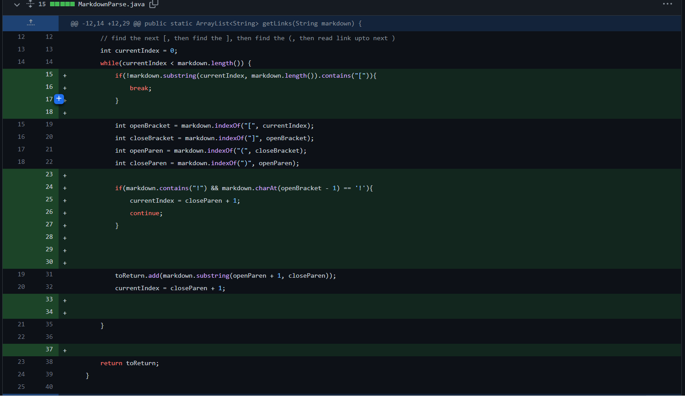
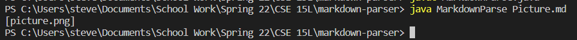
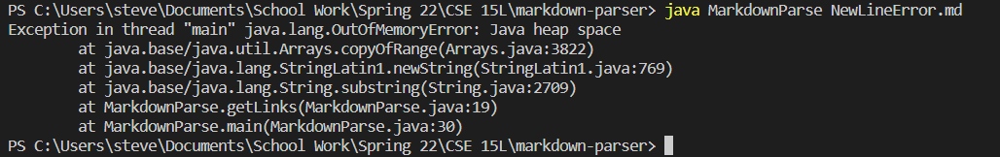
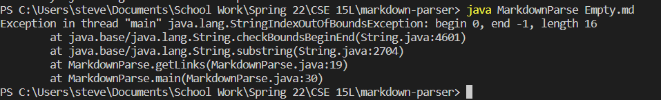

# Week 4 - Lab Report 2

This is the picture of the changes of the code where my group and I fixed three errors.  
  

The three errors that we were trying to solve with the three fixes that we made to the code was: 
* Pictures being mistakened for website links.  
    * [Picture Test File](threeTest/Picture.md)  
* New line causing a infinite loop.  
    * [NewLine Test File](threeTest/NewLineError.md)   
* Empty file or a file with no links. 
    * [Empty Test File](threeTest/Empty.md)  

## Picture 
The picture was causing problems for the code because it had the same format as putting a link in a markdown file ([]link()) the only differnce between the two is that the format for a picture you inlucde the ! at the beginning (![]picture()).

  

[Commit History](https://github.com/stevendtran/markdown-parser/commit/bdb8fdfbe8650312b2a2005f3b8ca8786fa49901)  

## New Line
The new line causes the code to go into a infinite loop because it keep looking for a link in the new line. However, because there is no link there, the code keeps on running and running until it runs out of memory.

[Commit History](https://github.com/stevendtran/markdown-parser/commit/c9001d4d0251745b40c124b6739d12574656e5f6)

## Empty File 
There is nothing for the code to look so the code throws a outofbound error. 

[Commit History](https://github.com/stevendtran/markdown-parser/commit/ba2cf219b8c0a1c3da0433f605e7894a00cc8909)

### Conclusion
The bug is the actual problem with the code like it not being able to read the file. Some of the symptoms of the code are where the code is doing things that it is not supposed to do such as counting pictures as links. The failure-inducing inputs are just the edge causes that the code does not account for like the new line error. The bug is something that would cause symptoms and failure-inducing inputs. 
