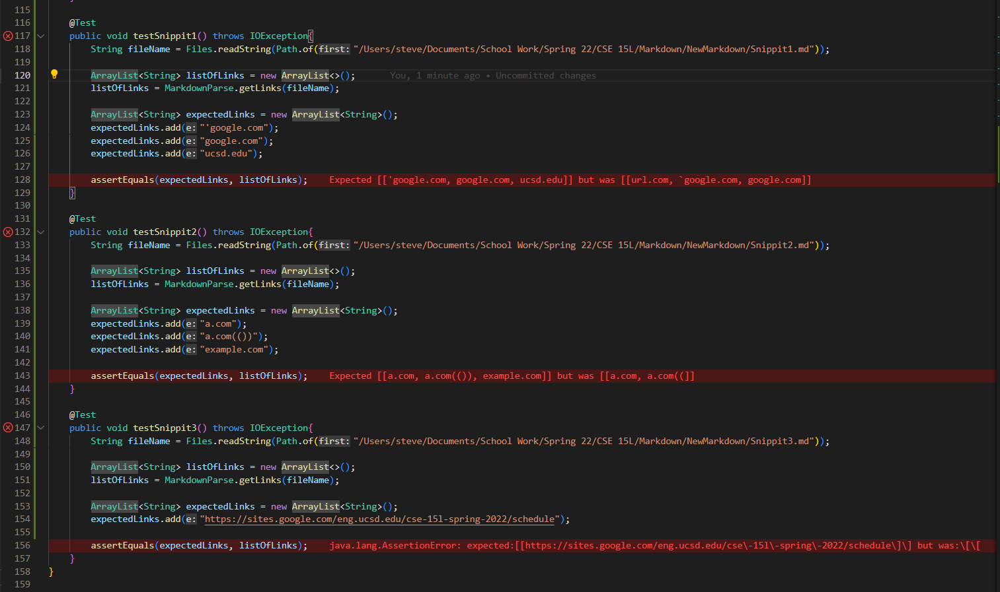
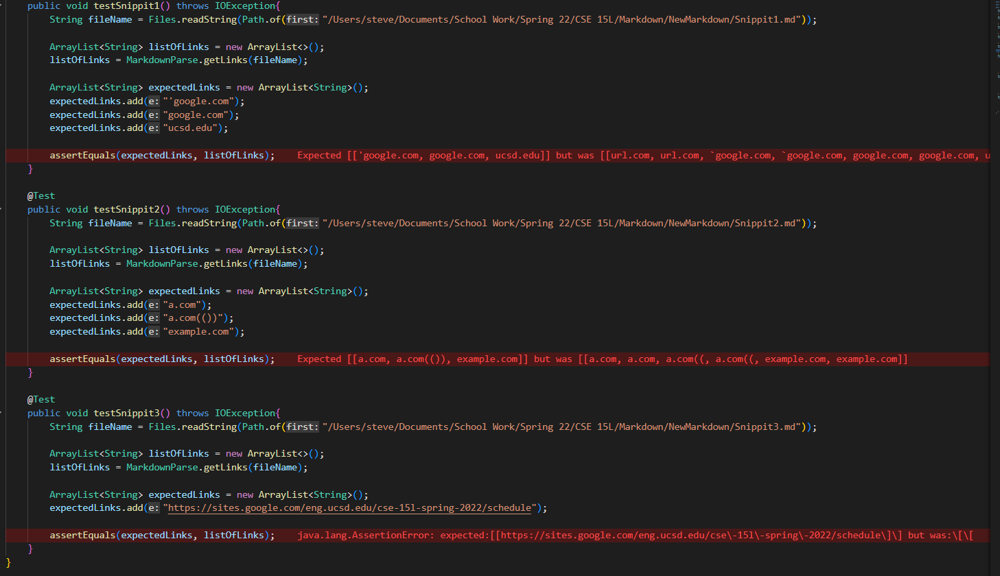

# Week 8 - Lab Report 4 

This is the [link](https://github.com/stevendtran/NewMarkdown) to my markdown parser.  
This is the [link](https://github.com/aejiang/markdown-parser) to the markdown parser that my group and I reviewed.   

## Results

This is the result of using my code on Snippit 1, Snippit 2, and Snippit 3.  
  
All of the test failed for Snippit 1-3 because of various reasons. One of the reasons being that I coded so everytime the code runs into something that causes problems, it breaks the loop.   

This is the result of the using the other group's code that we reviewed on Snippit 1, Snippit 2, and Snippit 3.  
  
All of the test failed for Snippit 1-3 also failed the test. 

## Debugging
**Snippit 1** : I believe that we would be able to make small changes to make my code work for snippit 1. What I would do is to check if there's a ' outside of the bracket and if there is a ' in the bracket. If there is one ' outside and one inside. That would mean that I would not have to count that link. 

**Snippit 2** : I am not sure that I would be able to make small changes, I do not believe I would be able to do it under 10 lines. I do not bleieve I can do it under 10 lines because the three things that are a part of snippit 2 are very different from one other and I would have to do several if statements. What I believe would work would look at a set of brackets and parentheses inside of the another set of brackets. The code would only get the link of the inside the outer set of brackets and not the link that is connected to the outside pair of brackets. (I do not understand if we are suppose to include both links, but I am assuming that we don't count the link that is not working on the preview.) As for the parentheses I would code it so it only get the link in between the outermost parentheses. This is because paratheses are common place in links.

**Snippit 3** : I believe I would be able to make small changes in order to make the program work for this file. What I would do is if there is a `/n` at the end of the link, that link would not be counted as a link.