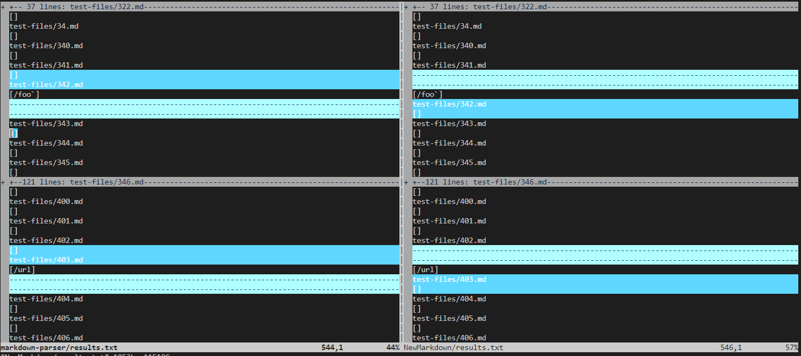
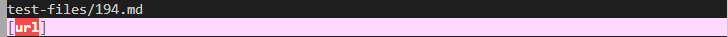
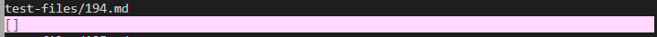
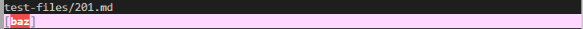
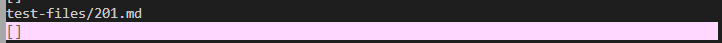

# Week 10 - Lab Report 5

*  I was able to find the test with the differenet results using vimdiff. By typing in `vimdiff markdown-parser/results.txt NewMarkdown/results.txt` the terminals shows the reults of the test and highlights those that are different.  
  

[Test file with different result #1](https://github.com/nidhidhamnani/markdown-parser/blob/main/test-files/194.md)  
This is the result of the given code:
  
This is the result of my code:
  

[Test file with different result #2](https://github.com/nidhidhamnani/markdown-parser/blob/main/test-files/201.md)  
This is the result of the given code:

This is the result of my code:

