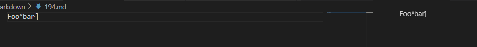

# Week 10 - Lab Report 5

I was able to find the test with the differenet results using vimdiff. By typing in `vimdiff markdown-parser/results.txt NewMarkdown/results.txt` the terminals shows the reults of the test and highlights those that are different.  
  

[Test file with different result #1](https://github.com/nidhidhamnani/markdown-parser/blob/main/test-files/194.md)    
This is the result of the given code:
  
This is the result of my code:
  

For this my implementation of code is correct and gives the correct output, an empty arraylist. While the given code output was incorrect. The arraylist is empty because there is no link in the test file so, nothing can be put into the arraylist. As seen in the preview of the test file 194, the text is not linked to a link.  
  

[Test file with different result #2](https://github.com/nidhidhamnani/markdown-parser/blob/main/test-files/201.md)    
This is the result of the given code:
  
This is the result of my code:
  

For this test file given code was correct a returned with a arraylist containing one link. However, my code returned an empty arraylist. When looking at the preview for test file 201 we can see that the text is linked to a link.  

### Fixes
For test file 194, the given code was one that returned the wrong output. I am unsure why the result just says url, it is very strange and I don't see what in the code would cause the code to act that way. It strange because in the test file there is not anything that says url. I would have to assume that there is something in the given code that causes it to think that * is always before an url. I know that there is a problem but I cannot seem to find what is actually causing the problem. 

For test file 201, my code was the one that returned the wrong output. I believe what is causing a problem is that my code does not account for links that are embeded in the text between the two open brackets. I believe to make my code work for this case I would have to check if the after the closing bracket theres is a colon (:) then a space. This would indicate to the code that there is a link that embeded, and to count that as a link and add it to the arraylist.
